## Building a REST API (CRUD) with Lambda,API GW and DynamoDB & REST API to SNS 

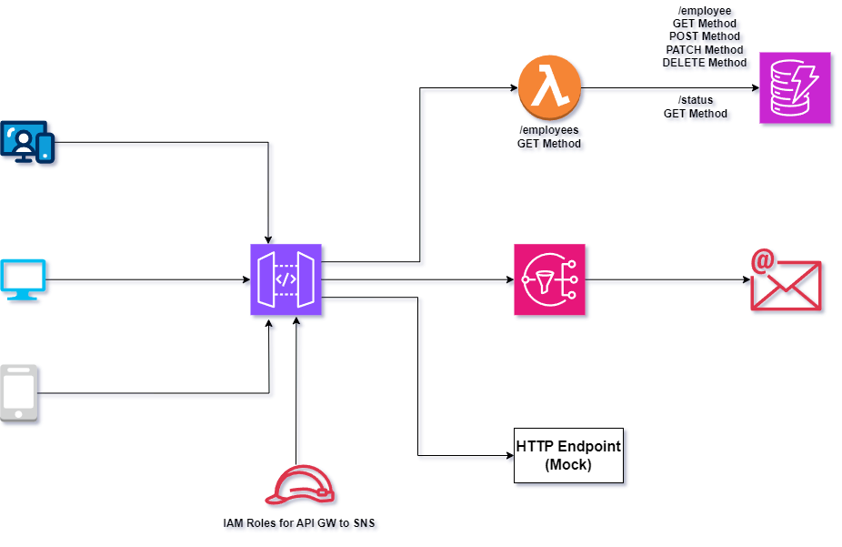

## Implementation Guide
After successfully provisioned with terraform,

- API GW STAGE URL

    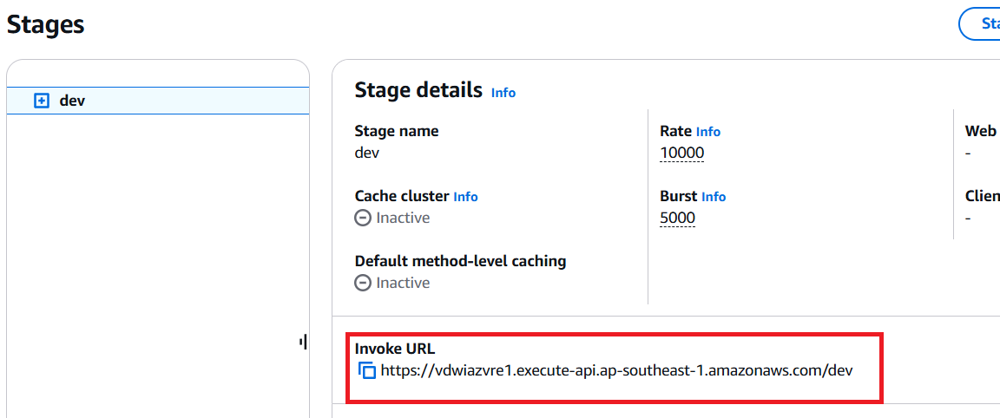

1. Build a REST API(CRUD) with Lambda,API GW and DynamoDB

    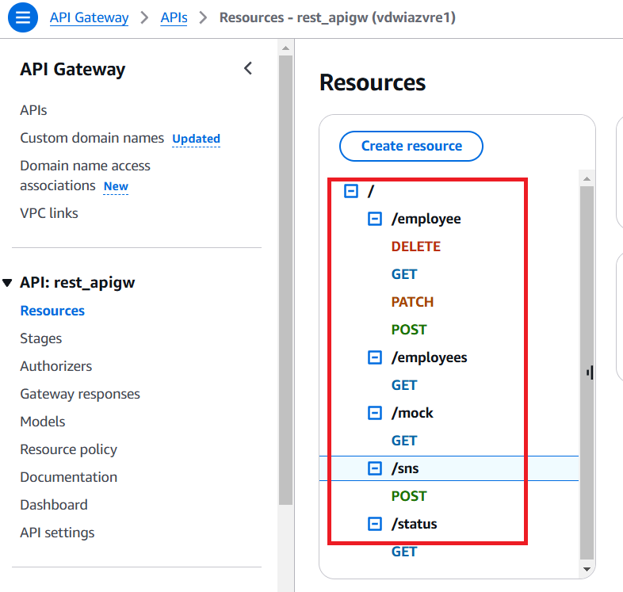

    - CREATE new data entries via API GW URL to DynamoDB Table

    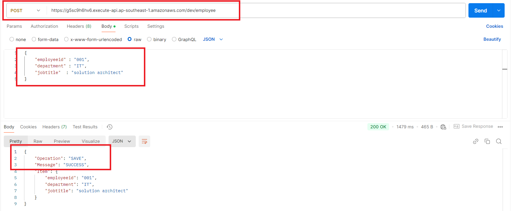

    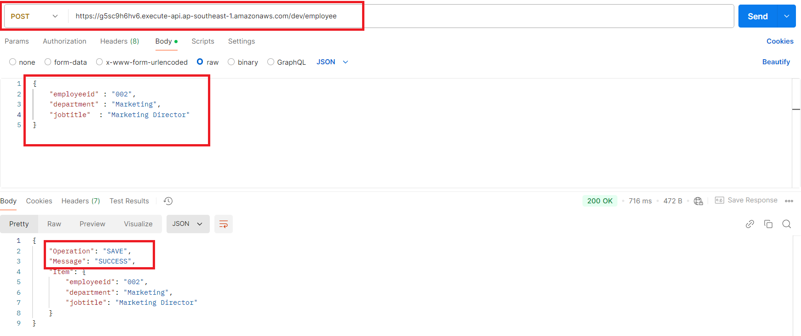

    - Two new data entries are successfully created in DynamoDB

    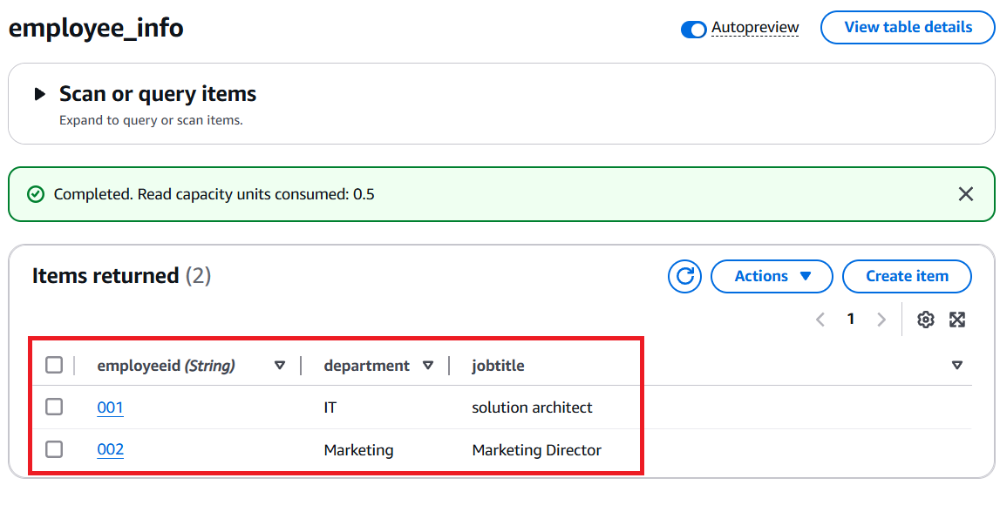

    - READ DynamoDB Table

    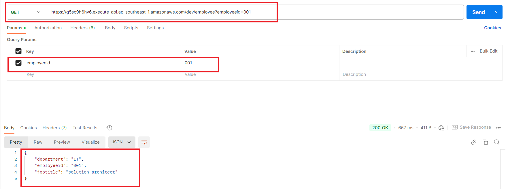

    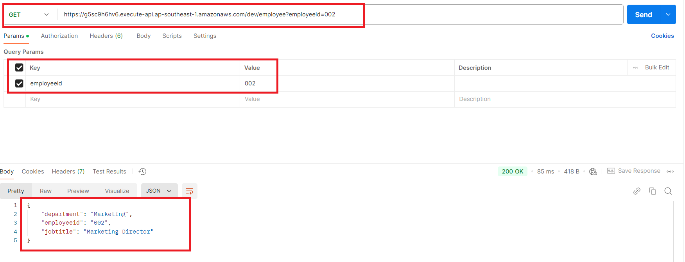

    - UPDATE DynamoDB Table

        `{
        "employeeId" : "001",
        "updateKey" : "jobtitle",
        "updateValue"  : "Devops Engineer"
        }`

    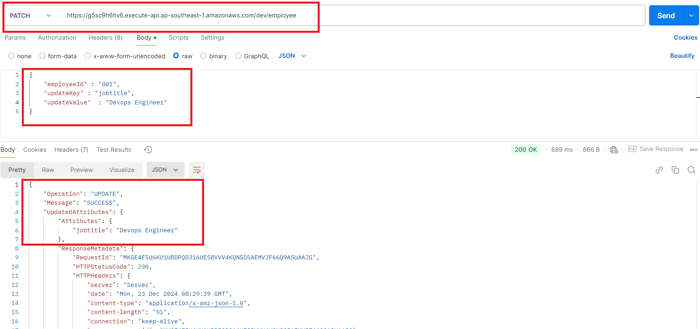

    - DELETE DynamoDB Table Entry

    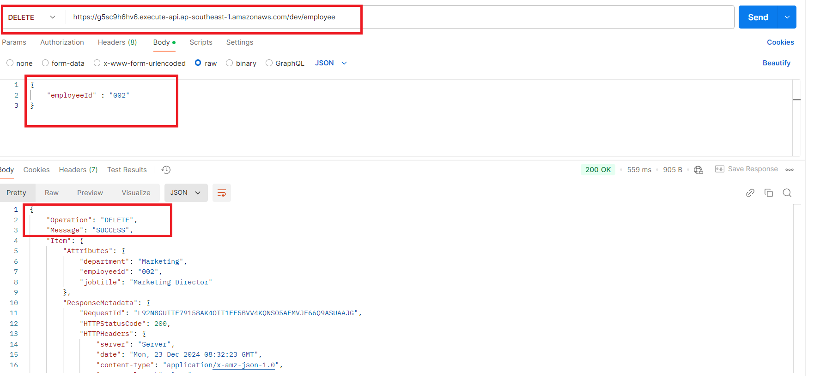

2. Check the entire DynamoDB Table

    `https://g5sc9h6hv6.execute-api.ap-southeast-1.amazonaws.com/dev/employees`

    

3. Check the DynamoDB Table Health Status

    `https://g5sc9h6hv6.execute-api.ap-southeast-1.amazonaws.com/dev/status`

    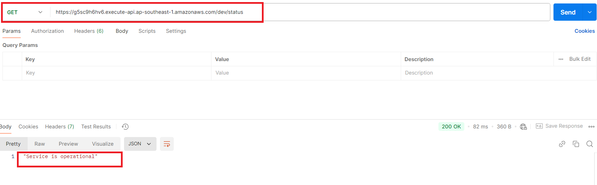

4. Check the mock endpoint of API GW

    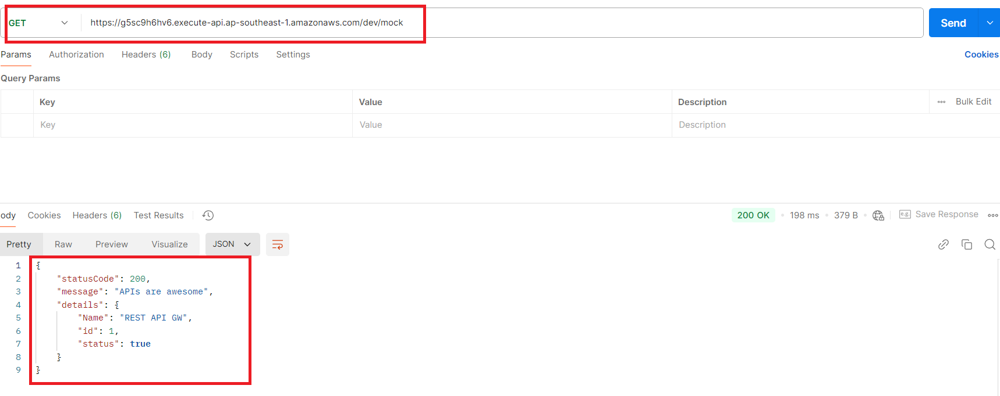

5. POST Method to SNS endpoint through API GW

    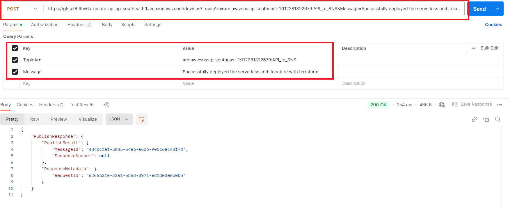

    - Sucessfully obtained POST request to receiver email address

        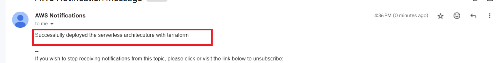